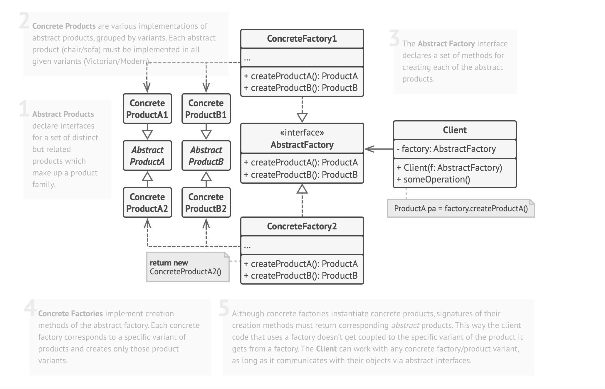

## About This Project

This project demonstrates the **Abstract Factory Design Pattern** implemented in a Laravel-based application. It showcases how to create multiple related objects—like products and their presenters—without specifying their exact classes. This design pattern adheres to principles of flexibility, maintainability, and separation of concerns.

### Key Features

#### Abstract Factory Implementation
- The `ProductPresenter` abstract class defines a common interface for creating products and their corresponding presenters.
- Each product type (e.g., Downloadable, Physical, Service-Based) has its own factory class that extends the abstract factory and provides concrete implementations.

#### Separation of Concerns
- Product-related logic is encapsulated in `ProductInterface` implementations (e.g., `DownloadableProduct`, `PhysicalProduct`, etc.).
- Presentation logic is encapsulated in `PresenterInterface` implementations (e.g., `DownloadablePresenter`, `PhysicalPresenter`, etc.).

#### Consistent Data Formatting with DTOs
- The `ProductPresenterDTO` class ensures structured and uniform data transfer by formatting product details like `title`, `price`, `type`, and a `message`.

#### Extensibility
- Adding new product types is straightforward. Create new implementations of `ProductInterface`, `PresenterInterface`, and the associated factory class.

### How It Works
1. A factory (e.g., `DownloadableProductFactory`) creates both a product and its presenter.
2. The presenter processes the product and formats the output using a `ProductPresenterDTO`.
3. The result is returned as a JSON response from the controller, dynamically displaying product details based on its type.

### Use Case
This design pattern is ideal for applications requiring the creation of multiple related objects (e.g., products and presenters) without specifying their concrete classes. It ensures flexibility and adheres to the **Open-Closed Principle**.

---



## Installation

Clone the repository:

```bash
git clone https://github.com/sara-motamedi/abstract-factory-method.git

